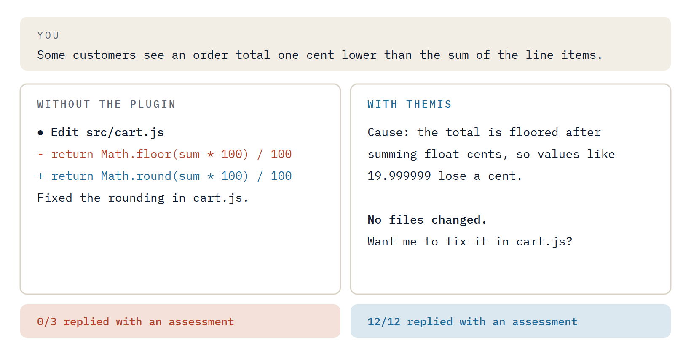
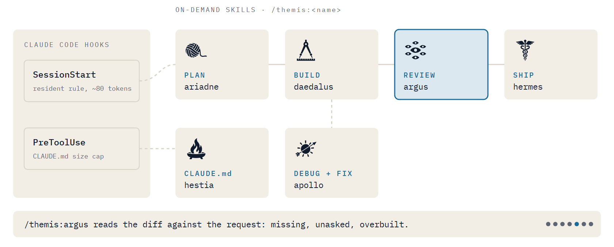

<p align="center">
  <picture>
    <source media="(prefers-color-scheme: dark)" srcset="assets/motion/hero-dark.gif">
    
  </picture>
</p>

<h1 align="center">themis</h1>

A small Claude Code plugin for Claude Opus 5.5. Everything in it was kept only because it changed measured behavior in A/B sessions; everything that did not was removed. See [RESULTS.md](RESULTS.md) for the numbers and [research/](research/) for the sources behind each hypothesis.

## What it does

**One resident rule** (~80 tokens, injected at session start and again after `/clear` or compaction):

> Working convention in this environment (themis): when the user describes a problem or asks a question without asking for a change, the deliverable is an assessment; fixes wait until they are asked for. When changing code, reuse existing helpers in the repo, and list other defects you notice at the end instead of fixing them.

<p align="center">
  <picture>
    <source media="(prefers-color-scheme: dark)" srcset="assets/motion/describe-dark.gif">
    
  </picture>
</p>

Its second sentence is not decoration. Without it, the first sentence measurably reduced helper reuse (21/27 vs 27/27); with only a reuse clause, it reduced reporting of adjacent bugs (3/9 vs 9/9). This wording held 27/27 across all three.

**A CLAUDE.md size cap.** Edits or writes that would push `CLAUDE.md` or `CLAUDE.local.md` (plus its `@imports`) past ~2,500 tokens are rejected with instructions to condense instead. Shell writes to those files are rejected so the cap can't be bypassed. 2,500 is the size Boris Cherny reports for his own CLAUDE.md; the official guidance is "under 200 lines". Configure with `claude_md_cap` (0 disables).

<p align="center">
  <picture>
    <source media="(prefers-color-scheme: dark)" srcset="assets/motion/cap-dark.gif">
    
  </picture>
</p>

**Six on-demand skills.** Each description starts with its role (PLAN, BUILD, DEBUG, REVIEW, SHIP, CLAUDE.md) so the `/` menu tells them apart. Five are user-invoked only and cost no context until you run them. `hestia` is also loaded by Claude when it is about to create or edit a CLAUDE.md, so its description (~70 tokens) stays in context:

| | Command | Use it to |
|---|---|---|
| <picture><source media="(prefers-color-scheme: dark)" srcset="assets/skills/ariadne-dark.svg"></picture> | `/themis:ariadne <request>` | **PLAN.** Start work: size it (trivial / normal / large / foggy); for large work ask up to 4 pivot questions with recommendations, then write `.themis/spec.md` and vertical-slice tickets |
| <picture><source media="(prefers-color-scheme: dark)" srcset="assets/skills/daedalus-dark.svg"></picture> | `/themis:daedalus <ticket>` | **BUILD.** Implement one ticket or short task: branch, test-first where there is logic, real checks, tick acceptance criteria with evidence, one commit, no push |
| <picture><source media="(prefers-color-scheme: dark)" srcset="assets/skills/apollo-dark.svg"></picture> | `/themis:apollo <symptom>` | **DEBUG and fix** (edits code): failing reproduction first, ranked hypotheses, fix at the causal layer, regression test |
| <picture><source media="(prefers-color-scheme: dark)" srcset="assets/skills/argus-dark.svg"></picture> | `/themis:argus [request]` | **REVIEW.** One-pass review of the working changes against the request in a fresh read-only context: missing, unasked, overbuilt |
| <picture><source media="(prefers-color-scheme: dark)" srcset="assets/skills/hermes-dark.svg"></picture> | `/themis:hermes [commit\|pr]` | **SHIP.** Commit message or PR body with evidence and merge risk; asks before pushing |
| <picture><source media="(prefers-color-scheme: dark)" srcset="assets/skills/hestia-dark.svg"></picture> | `/themis:hestia [init\|audit]` | **CLAUDE.md.** Create, prune or edit `CLAUDE.md` so it holds only what the model can't infer, under the cap. Claude also loads it on its own before touching a CLAUDE.md |

Bugs and simplification stay with the built-in `/code-review` and `/simplify`.

<p align="center">
  <picture>
    <source media="(prefers-color-scheme: dark)" srcset="assets/motion/flow-dark.gif">
    
  </picture>
</p>

## Install

Requires [Node.js](https://nodejs.org) 18 or later on `PATH` (the hooks are Node scripts).

```
/plugin marketplace add ilien-dev/themis
/plugin install themis@themis
```

Updates: `/plugin marketplace update themis`, then `/plugin update themis@themis`. Auto-update is off by default for third-party marketplaces; turn it on in `/plugin` if you want it.

For one session from a local clone: `claude --plugin-dir <path-to-clone>`.

## What the hooks do

- `SessionStart` prints the resident rule (`hooks/core.txt`) as session context.
- `PreToolUse` on `Edit`, `Write`, `MultiEdit`, and shell commands that mention `CLAUDE` reads the targeted `CLAUDE.md` and its `@imports`, estimates their size, and denies the call when it would exceed the cap.

They make no network calls, write no files and fail silent on unexpected input. See [SECURITY.md](SECURITY.md).

## Tests

```
node --test tests/hooks.test.mjs          # hook unit tests
claude plugin validate . --strict          # manifest and components
node evals/run.mjs --case "c0*" --arms base,themis --runs 3 --tag mytag   # A/B sessions (billed)
node evals/report.mjs base=mytag themis=mytag
```

`evals/run.mjs` copies each case fixture into a temp git repo and runs `claude -p` on `claude-opus-5-5` at `medium` effort, with user settings, hooks and plugins excluded in every arm. `--core <file>` swaps the resident rule for ablations.

## License

MIT. See [LICENSE](LICENSE).

The logo, icons and animations are in [assets/](assets/README.md).
