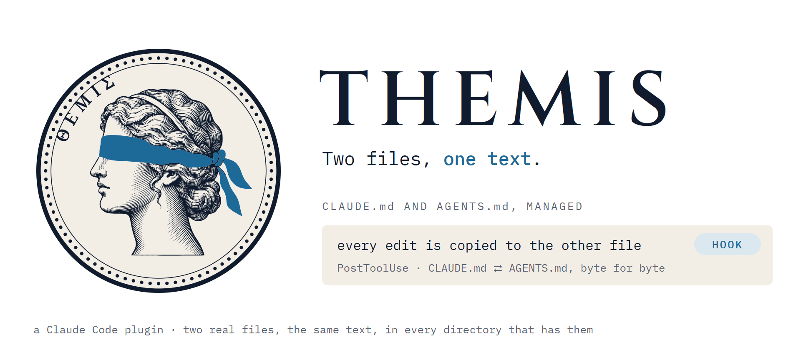
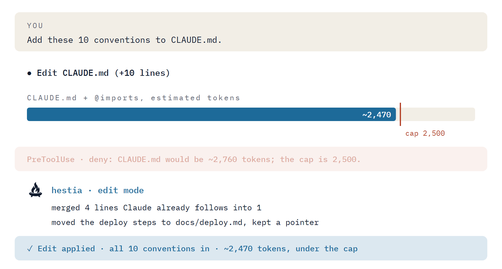
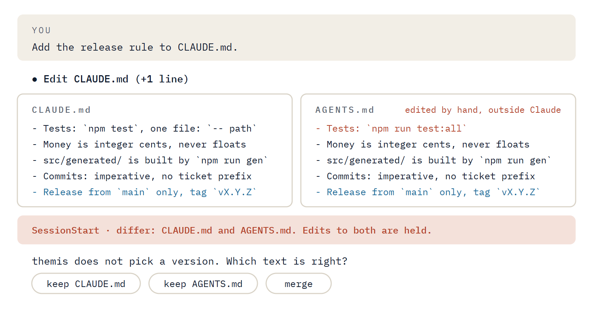

<p align="center">
  <picture>
    <source media="(prefers-color-scheme: dark)" srcset="assets/motion/hero-dark.gif">
    
  </picture>
</p>

<h1 align="center">themis</h1>

A Claude Code plugin that manages a repository's rule files, `CLAUDE.md` and `AGENTS.md`. It keeps them short, and it keeps the two identical.

## The problem

Rule files go wrong in two ways.

**They grow.** Every correction becomes another line, and nobody removes the lines the model would follow anyway. A long file costs tokens in every session and buries the few lines that matter: the test command that isn't guessable, the generated directory that must not be edited.

**They fork.** Claude Code reads `CLAUDE.md`. Codex, Cursor, Copilot and others read `AGENTS.md`. A repository that wants both ends up with two files that someone has to keep in step by hand, and one of them is always a few edits behind.

themis handles both with one skill and three hooks.

## Which file Claude Code reads

As of Claude Code v2.1.277, from the [memory documentation](https://code.claude.com/docs/en/memory):

| The repository has | Claude Code reads |
|---|---|
| `AGENTS.md` and no `CLAUDE.md` or `CLAUDE.local.md` in the working directory or above it | `AGENTS.md` |
| `AGENTS.md` and a `CLAUDE.md` or `CLAUDE.local.md` | the `CLAUDE.md` files only |

So with the pair themis maintains, Claude Code reads `CLAUDE.md` and ignores `AGENTS.md`, which is there for every other tool. Nothing is loaded twice.

One setting changes that. If you set **Project instructions** to `claude-md-and-agents-md` in `/config`, Claude Code loads both files. It skips an `AGENTS.md` that `CLAUDE.md` imports or symlinks to, but two separate identical files are both loaded, and the rules cost twice the tokens. Leave the setting on its default with themis.

Versions before v2.1.277 never read `AGENTS.md` on their own.

## The skill

`/themis:themis [init | audit | sync]`. Claude also loads it by itself before it creates or edits a `CLAUDE.md`, `AGENTS.md` or `CLAUDE.local.md`, so its description (about 125 tokens) stays in context.

| Mode | What it does |
|---|---|
| `init` | Reads the manifest, scripts, CI config and a few source files, runs the test and build commands it finds, and writes a file with only the lines that pass one test: *would the model make a mistake in this repo without it?* |
| `audit` | Checks every line and command of the existing files against the repo and marks each keep, cut, fix or move. Shows the table, then applies what you approve. |
| edit | The default when Claude is about to change a rule file in the middle of other work. Adds what was asked in the shortest form, and condenses nearby lines when the result would pass the cap. It does not audit the rest. |
| `sync` | Brings a pair back to identical: creates the missing file, or shows how two files differ and asks you which text is right. |

What it keeps: commands that aren't guessable, conventions that differ from the framework default, gotchas, repo etiquette, and pointers to docs. What it cuts: project overviews, anything the code already shows, generic advice, rules the model follows anyway, and long procedures (those move to a doc, with a pointer).

## The size cap

<p align="center">
  <picture>
    <source media="(prefers-color-scheme: dark)" srcset="assets/motion/cap-dark.gif">
    
  </picture>
</p>

An `Edit`, `Write` or `MultiEdit` that would take `CLAUDE.md`, `AGENTS.md` or `CLAUDE.local.md` past about 2,500 tokens is denied, with instructions to condense instead. Files pulled in with `@path` count toward the total. An edit that shrinks a file already over the cap is allowed.

Shell commands that write to those files (`>`, `>>`, `tee`, `sed -i`, `perl -i`, `Set-Content`, `Add-Content`, `Out-File`) are denied, so the cap can't be bypassed from the shell.

2,500 tokens is the size Boris Cherny reports for his own CLAUDE.md; the official guidance is "under 200 lines". The estimate is characters ÷ 3.6. Configure it with `claude_md_cap` (0 disables it).

## Parity

<p align="center">
  <picture>
    <source media="(prefers-color-scheme: dark)" srcset="assets/motion/parity-dark.gif">
    
  </picture>
</p>

`CLAUDE.md` and `AGENTS.md` in the same directory are two real files with the same bytes. Not an `@AGENTS.md` import and not a symlink: a tool that reads only one of them gets the whole text.

**Edits are copied.** After Claude edits either file, a `PostToolUse` hook copies it over the other one, byte for byte, and creates the other one if it doesn't exist. Claude edits one file; there is no second step to forget.

**A difference is never resolved for you.** If the two files already differ when Claude tries to edit one, somebody changed one of them outside themis: in an editor, with `git checkout`, in a merge. Copying would silently discard one side, so the `PreToolUse` hook stops instead:

- `Edit` and `MultiEdit` are denied. Claude is told which two files differ and to ask you which text is right.
- `Write`, which replaces the whole file, raises a permission prompt that says both files will get this text. This is how a difference gets resolved: the skill shows you the diff, you choose one side or a merge, and you approve the write. In an unattended `claude -p` run nobody can answer the prompt, so the write is denied and the difference stays for a person to resolve.
- Creating the missing file of a pair is allowed only as an exact copy of the one that exists.

**Differences are reported.** At session start, and after any shell command that names one of the files, themis checks every pair: the working directory up to the repository root, and every directory below it (from `git ls-files`, so ignored directories are skipped). If all pairs match it says nothing. Otherwise Claude gets one line per pair, such as `differ: CLAUDE.md (modified 2026-10-08 07:59 UTC) and AGENTS.md (modified 2026-10-07 18:02 UTC)`, with the instruction to tell you and not to choose a version.

What parity covers:

| File | Cap | Parity |
|---|---|---|
| `CLAUDE.md` ⇄ `AGENTS.md`, in the repository root and any subdirectory | yes | yes |
| `.claude/CLAUDE.md` ⇄ `.claude/AGENTS.md` in a project | yes | yes |
| `CLAUDE.local.md` | yes | no. It is personal and uncommitted, and no tool reads an `AGENTS.local.md` |
| `~/.claude/CLAUDE.md` and the managed-policy `CLAUDE.md` | yes | no. Those directories belong to Claude Code |
| A pair linked by an `@AGENTS.md` import or a symlink | yes | left as it is and reported; `sync` offers to turn it into two copies |

Limits worth knowing:

- The hooks see Claude's tool calls. A change made in your editor or by git is not blocked; it is reported at the next session start, or the next time Claude touches the files.
- The shell block matches common write commands, not every program that can write a file. What it misses is caught by the report after the command.
- Outside a git repository the check walks four directory levels below the working directory.

Turn parity off with the `parity` option if you want only one of the two files; the cap keeps working.

## Install

Requires [Node.js](https://nodejs.org) 18 or later on `PATH` (the hooks are Node scripts, compiled from TypeScript and shipped in `hooks/dist/`; installing needs no build step).

```
/plugin marketplace add ilien-dev/themis
/plugin install themis@themis
```

Then run `/themis:themis` once in each repository. It creates whichever of the two files is missing, or audits the ones you have.

Updates: `/plugin marketplace update themis`, then `/plugin update themis@themis`. Auto-update is off by default for third-party marketplaces; turn it on in `/plugin` if you want it.

For one session from a local clone: `claude --plugin-dir <path-to-clone>`.

Coming from 1.x? Version 2.0.0 removes five skills and the resident rule; see the migration notes in [CHANGELOG.md](CHANGELOG.md).

## Options

| Option | Default | |
|---|---|---|
| `claude_md_cap` | `2500` | Maximum estimated tokens for a rule file including its imports. `0` disables the cap. |
| `parity` | `true` | Copy edits between `CLAUDE.md` and `AGENTS.md` and report pairs that differ. |

## What the hooks do

| Event | Runs on | Does |
|---|---|---|
| `PreToolUse` | `Edit`, `Write`, `MultiEdit`; shell commands that mention `CLAUDE` or `AGENTS` | Denies an edit over the cap, a shell write to a rule file, and an edit to a pair that already differs. Asks you to confirm a `Write` to such a pair. |
| `PostToolUse` | `Edit`, `Write`, `MultiEdit`; shell commands that mention `CLAUDE` or `AGENTS` | Copies the edited file to its twin. After a shell command, reports pairs that differ. |
| `SessionStart` | every start, resume, `/clear` and compaction | Reports pairs that differ, are incomplete, or are linked instead of copied. Silent otherwise. |

The only file a hook ever writes is the `CLAUDE.md` or `AGENTS.md` next to the one Claude just edited. They make no network calls and fail silent on unexpected input. See [SECURITY.md](SECURITY.md).

## Development

Everything is strict TypeScript. The hooks in `hooks/*.ts` are compiled to `hooks/dist/`, which is committed because Claude Code runs a plugin straight from its repository. The tests and the scripts in `evals/` and `assets/` run as `.ts` files, which needs Node.js 22.18 or later.

```
npm ci
npm run check                              # typecheck, lint, build and test, in that order
npm run build                              # hooks/*.ts -> hooks/dist/*.js; commit the result
npm test                                   # hook tests: cap, shell block, parity
claude plugin validate . --strict          # manifest and components
```

`npm run typecheck` and `npm run lint` also cover the scripts in `assets/`, so they need `npm ci` in `assets/source` and `assets/motion/source` first.

CI runs the same checks on every pull request and fails when `hooks/dist/` does not match its source. To release, raise `version` in `.claude-plugin/plugin.json` and `package.json` and add a section to `CHANGELOG.md`: when that reaches `main`, CI creates the tag `v<version>` and publishes the GitHub release.

What was measured in real sessions, and what was not, is in [RESULTS.md](RESULTS.md).

## License

MIT. See [LICENSE](LICENSE).

The logo and animations are in [assets/](assets/README.md).
