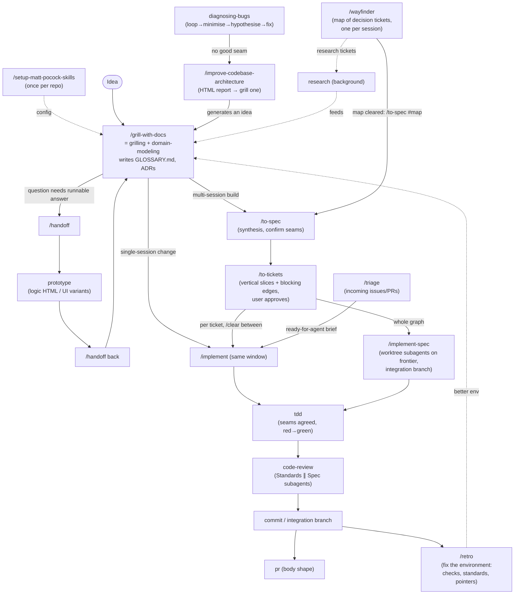

# 04 · mattpocock/skills: research notes

Research input for the design of a Claude Code plugin: a full solo-developer workflow on Claude Code with Opus 5.5 that counters common model vices. These are notes only. Nothing here is a plugin file.

**Snapshot.** `https://github.com/mattpocock/skills`, shallow clone at commit `d81f3a1` ("Merge pull request #1120 from mattpocock/release/v1.3"), 2026-09-29. `plugin.json` still reads `1.2.3`, but HEAD is the v1.3 release merge. The pending `.changeset/` files graduate `implement-spec`, `retro` and `pr` into the promoted set, remove `resolving-merge-conflicts`, and rename `CONTEXT.md`/`CONTEXT-MAP.md` to `GLOSSARY.md`/`GLOSSARY-MAP.md`. The inventory below describes HEAD.

**Sources.** Every `SKILL.md` and its supporting files, `README.md`, `CLAUDE.md`, `.agents/*` (invocation rules, install block, ADRs), `.out-of-scope/*`, `CHANGELOG.md`, and the "Common questions" / "It's working if" sections of the `docs/` pages. Those pages are the published aihero.dev pages, and they are curated from GitHub issues. The top roughly 45 issues by comments plus reactions were read with `gh`.

**Name drift.** The names used in the task brief are stale. The changelog confirms these renames: `to-prd` → `to-spec`, `to-issues` → `to-tickets`, `decision-mapping` → `wayfinder`, `diagnose` → `diagnosing-bugs`, in-progress `review` → `code-review`, `writing-great-skills` → `writing-for-agents`, `batch-grill-me` folded into `grilling`. `write-a-prd` and `prd-to-issues` were earlier names in the same PRD/issues lineage. The depth-1 clone has no history, so the exact chain is not verified here. Skills that have been removed: `ubiquitous-language` (now `domain-modeling`), `design-an-interface` (now `codebase-design/DESIGN-IT-TWICE.md`), `qa` (now `triage` + `to-tickets`), `request-refactor-plan` (now `to-spec` + `improve-codebase-architecture`), `caveman`, `zoom-out`, `edit-article`, `obsidian-vault`, and `resolving-merge-conflicts`.

---

## 1. Inventory by workflow phase

Key: **U** means user-invoked (`disable-model-invocation: true`, human-facing description, only the human can fire it). **M** means model-invoked (rich trigger description, the model or the user can fire it). The repo applies one invariant: a U skill may call M skills through the Skill tool, but nothing can reach a U skill.

### 1.0 Router and setup

| Skill | Inv | Purpose / trigger description | Workflow | Key verbatim rules | Files |
|---|---|---|---|---|---|
| `ask-matt` | U | "Ask which skill or flow fits your situation. A router over the skills in this repo." | Prose map covering the main flow, the on-ramps, codebase health, the vocabulary layer, phase boundaries and standalone skills. | "Keep steps 1–3 in **one unbroken context window** (don't compact or clear until after `/to-tickets`)"; "`/compact` is the **default, not the first reach**". Phase-boundary tree, where the first yes wins: Continue → `/clear` → `/handoff` (only for a new harness, a new dir, a colleague, or a mid-phase fork) → subagent (when AFK-able) → `/compact`. Smart zone is about 150k tokens. | `PHASE-BOUNDARIES.md` |
| `setup-matt-pocock-skills` | U | "Configure this repo for the engineering skills: set up its issue tracker, triage label vocabulary, and domain doc layout. Run once…" | Explore (git remote, CLAUDE/AGENTS.md, GLOSSARY, docs/adr, .scratch, monorepo signals) → present, asking one section at a time with a recommended answer → confirm drafts → write `docs/agents/{issue-tracker,domain,triage-labels}.md` plus an `## Agent skills` block in the existing CLAUDE.md or AGENTS.md. | "Never create `AGENTS.md` when `CLAUDE.md` already exists"; "Lead each section with the recommended answer so the user can accept it in a word." Domain docs: "If any of these files don't exist, **proceed silently**." | `issue-tracker-{github,gitlab,local}.md`, `triage-labels.md`, `domain.md` |

The per-repo config uses a pointer pattern. `CLAUDE.md` holds three one-line pointers into `docs/agents/*.md`. Hard-dependency skills (`to-spec`, `to-tickets`, `triage`, `wayfinder`, `implement-spec`, `code-review`) say "should have been provided to you; if not, tell the user to run `/setup-matt-pocock-skills`". Soft-dependency skills only mention "the project's glossary/ADRs" in vague prose (ADR-0001). The local tracker is `.scratch/<feature>/spec.md` plus `.scratch/<feature>/issues/NN-slug.md`, with `Status:` and `Blocked by:` lines.

### 1.1 Idea and requirements (alignment)

| Skill | Inv | Purpose / trigger | Workflow | Key verbatim rules | Files |
|---|---|---|---|---|---|
| `grilling` | M | "Grill the user relentlessly about a plan, decision, or idea. Use when the user wants to stress-test their thinking, or uses any 'grill' trigger phrases." | Build a **design tree**. Each round asks the whole **frontier** (decisions whose prerequisites are settled), numbered, each with a recommended answer. Wait, recompute the frontier, repeat. | "Finding _facts_ is your job, never the user's… dispatch a sub-agent… The _decisions_ are the user's"; "A question whose answer depends on another question still open in this round belongs to a _later_ round"; "Do not act on it until the user confirms you have reached a shared understanding." Format: `❓ **Q1** - **title**: …` / `➡️ recommendation` / `---`. | none |
| `grill-me` | U | "A relentless interview to sharpen a plan or design." | The whole body is "Call the Skill tool with "grilling"." It is stateless and intended for non-repo work. | none | none |
| `grill-with-docs` | U | "A relentless interview… which also creates docs (ADR's and glossary) as we go." | The whole body is "Call the Skill tool twice, for "grilling" and "domain-modeling"." This is the recommended entry point for all repo work. | none | none |
| `domain-modeling` | M | "Build and sharpen a project's domain model. Use when discussing codebase terminology, writing or editing a GLOSSARY.md, or recording or editing an ADR." | Challenge terms against the glossary, sharpen fuzzy language, stress-test with invented edge-case scenarios, cross-check the user's claims against the code, update `GLOSSARY.md` inline, and offer ADRs sparingly. | "Your code cancels entire Orders, but you just said partial cancellation is possible. Which is right?"; "`GLOSSARY.md` should be totally devoid of implementation details"; ADRs only when "Hard to reverse", "Surprising without context" and "The result of a real trade-off" all hold; create files lazily. | `GLOSSARY-FORMAT.md` (term, one-to-two-line definition, `_Avoid_:` synonyms), `ADR-FORMAT.md` (`docs/adr/NNNN-slug.md`, can be one paragraph) |
| `prototype` | M | "Build a throwaway prototype to answer a design question. Use when… sanity-check whether a state model or logic feels right, or explore what a UI should look like." | Pick a branch. LOGIC: one self-contained HTML file with a pure reducer or state-machine module, free-play buttons and tabbed scenario walkthroughs. UI: 3 (at most 5) structurally different variants on an existing route via `?variant=`, with a floating switcher. Capture the answer, fold the decision into the code, and keep the prototype on a `prototype/<name>` branch with a pointer from the issue. | "throwaway code that answers a question"; "Don't add tests. A prototype that needs tests is no longer a prototype"; "Variants must be **structurally different**"; hide the switcher in production. | `LOGIC.md`, `UI.md` |
| `research` | M | "Investigate a question against high-trust primary sources and capture the findings as a Markdown file… delegated to a background agent." | Run a background agent that reads primary sources and writes one cited Markdown file where the repo keeps notes. | "Follow every claim back to the source that owns it." | none |
| `to-questionnaire` | U | "Turn a decision you can't fully answer into a questionnaire for someone else to fill in." | Two single-exchange questions (who it is for, what you need back) → write `to-questionnaire-<slug>.md` from a template. | "**Grill the send, not the subject.**" | none |
| `wayfinder` | U | "Plan a huge chunk of work (more than one agent session can hold) as a shared map of decision tickets…" | *Chart*: grill to name the **destination** → breadth-first grill for the frontier (stop if there is no fog) → create a `wayfinder:map` issue (Destination / Notes / Decisions so far / Not yet specified / Out of scope) → create child **decision tickets** typed research, prototype, grilling or task, then wire native blocking in a second pass → fire research subagents → stop. *Work*: load the map → claim the first frontier ticket by assigning it → resolve → post a resolution comment, close, and append a gist line to the map → graduate fog. | "Plan, don't do… produce decisions, not deliverables"; "never resolve more than one ticket per session" (research excepted); "a grilling agent that answers its own questions has broken this"; the map is "an **index**, not a store". | Tracker "Wayfinding operations" sections in the setup templates (GitHub sub-issues and `issues/<n>/dependencies/blocked_by` API) |

### 1.2 Spec and planning

| Skill | Inv | Purpose / trigger | Workflow | Key verbatim rules |
|---|---|---|---|---|
| `to-spec` | U | "Turn the current conversation into a spec and publish it… no interview, just synthesis of what you've already discussed." | Explore the repo → sketch **test seams** and confirm them with the user → write the spec (Problem, Solution, a LONG list of user stories, Implementation Decisions, Testing Decisions, Out of Scope, Further Notes) → publish with `ready-for-agent`. | "Do NOT interview the user; just synthesize"; "Use the highest seam possible… the ideal number is one"; "Do NOT include specific file paths or code snippets" (except prototype-derived snippets that encode a decision). |
| `to-tickets` | U | "Break a plan, spec, or the current conversation into a set of tracer-bullet tickets, each declaring its blocking edges…" | Gather context → optionally explore, looking for **prefactoring** ("Make the change easy, then make the easy change") → draft vertical slices with blocking edges → quiz the user (granularity, edges, merge or split) until approved → publish in dependency order (one local file per ticket, or native blocking links). | Vertical-slice rules: "narrow but COMPLETE path through every layer"; "demoable or verifiable on its own"; "sized to fit in a single fresh context window"; "prefactoring should be done first". **Wide refactor** exception: expand → migrate in batches sized by blast radius → contract. Ticket template: What to build / Blocked by / Acceptance criteria. |
| `triage` | U | "Move issues and external PRs through a state machine of triage roles, categorise, verify, grill if needed, and write agent-ready briefs." | Show the attention buckets → for one issue: gather context plus a **redundancy** check plus a **prior rejection** check (`.out-of-scope/`) → recommend and wait → **verify the claim** (reproduce the bug, run the PR) → grill if needed → apply the outcome: agent brief, needs-info notes, or wontfix (rejected enhancements are written to `.out-of-scope/<concept>.md`). | Roles: `bug`/`enhancement` × `needs-triage`/`needs-info`/`ready-for-agent`/`ready-for-human`/`wontfix`. Every comment starts with "*This was generated by AI during triage.*" Briefs: "Durability over precision", "Behavioral, not procedural", no file paths or line numbers, testable acceptance criteria, explicit out of scope. Supporting files: `AGENT-BRIEF.md`, `OUT-OF-SCOPE.md`. |

### 1.3 Implementation (TDD)

| Skill | Inv | Purpose / trigger | Workflow | Key verbatim rules |
|---|---|---|---|---|
| `implement` | U | "Implement a piece of work based on a spec or set of tickets." | The whole body is five lines: use /tdd at pre-agreed seams; typecheck and run single test files regularly; run the full suite once at the end; /code-review; commit to the current branch. | "Run typechecking regularly, single test files regularly, and the full test suite once at the end." |
| `implement-spec` | U | "Implement the result of /to-spec and /to-tickets in code." | Read the spec as a **task graph** → optional exploration subagent that writes notes outside the repo → create the **integration branch** → implementer subagents in background worktrees on the ready **frontier**, each calling `tdd` and merging the integration tip before reporting → a merger subagent merges → recompute the frontier → run `code-review` once at the end, with one fix subagent → mark the PR ready or resolve the tickets → clean up worktrees. | "Communication to and from subagents should be sparse… through **context pointers**"; "Implementer subagents should be run in the background where possible for maximum concurrency." |
| `tdd` | M | "Test-driven development. Use when the user wants to build features or fix bugs test-first, mentions "red-green-refactor", or wants integration tests." | Agree the seams with the user → loop: one failing test → minimal code → repeat. | "**Test only at pre-agreed seams.** … No test is written at an unconfirmed seam"; anti-patterns: **implementation-coupled**, **tautological** ("Expected values must come from an independent source of truth"), **horizontal slicing** ("writing all tests first, then all implementation"); "**Red before green**… Don't anticipate future tests or add speculative features"; "**Refactoring is not part of the loop.** It belongs to the review stage." Supporting files: `tests.md` (good and bad examples), `mocking.md` ("Mock at **system boundaries** only", dependency injection, SDK-style interfaces). |
| `codebase-design` | M | "Shared vocabulary for designing deep modules. Use when… design or improve a module's interface, find deepening opportunities, decide where a seam goes, make code more testable or AI-navigable…" | Reference only: glossary (module, interface, depth, seam, adapter, leverage, locality), plus principles. | "**The deletion test**"; "**The interface is the test surface**"; "**One adapter means a hypothetical seam. Two adapters means a real one.**" Supporting files: `DEEPENING.md` (four dependency categories; "replace, don't layer" tests), `DESIGN-IT-TWICE.md` (3+ parallel subagents under different constraints, then an opinionated recommendation). |
| `wizard` | M | "Generate an interactive bash wizard that walks a human through steps only they can perform… Don't invoke this for steps the agent can perform itself." | Scope the stages and captured values from the repo (.env, CI `secrets.*`) → map each stage's click-path → copy `template.sh` and author the stages → `bash -n` / shellcheck → static trace; never run it end to end. | "never invent steps that may not exist"; "`confirm` before any irreversible action". Supporting file: `template.sh`. |

### 1.4 Review, refactor and debugging

| Skill | Inv | Purpose / trigger | Workflow | Key verbatim rules |
|---|---|---|---|---|
| `code-review` | M | "Review the changes since a fixed point… along two axes: Standards… and Spec… Runs both reviews in parallel sub-agents…" | Pin the fixed point (`git diff <fp>...HEAD`) and fail early on a bad ref or empty diff → find the spec (commit refs, argument, docs/specs/.scratch, or ask) → find the standards sources plus a **12-smell Fowler baseline** → spawn two parallel subagents (each report under 400 words) → aggregate without reranking. | Spec axis: "(a) requirements… missing or partial; (b) behaviour in the diff that wasn't asked for (scope creep); (c)… implementation looks wrong. Quote the spec line"; smells are "always a judgement call"; "The repo overrides"; "Do **not** merge or rerank findings". |
| `diagnosing-bugs` | M | "Diagnosis loop for hard bugs and performance regressions. Use when the user says "diagnose"/"debug this", or reports something broken/throwing/failing/slow." | Redact → P1 **build a tight, red-capable feedback loop** (10 ranked techniques, HITL script as the last resort) → P2 reproduce and **minimise** → P3 generate 3–5 ranked falsifiable hypotheses and show the user → P4 instrument one variable at a time with `[DEBUG-xxxx]` tags → P5 regression test at a *correct seam*, then fix → P6 cleanup checklist. | "If you catch yourself reading code to build a theory before this command exists, **stop**"; "Single-hypothesis generation anchors on the first plausible idea"; "If no correct seam exists, that itself is the finding"; "The hypothesis that turned out correct is stated in the commit / PR message". Supporting file: `scripts/hitl-loop.template.sh`. |
| `improve-codebase-architecture` | U | "Scan a codebase for deepening opportunities, present them as a visual HTML report, then grill through whichever one you pick." | Scope by git hot spots (YAGNI) → an exploration subagent notes friction and applies the deletion test → write a self-contained Tailwind/Mermaid HTML report to OS temp, one before/after card per candidate plus a top recommendation → "Do NOT propose interfaces yet" → grilling plus domain-modeling on the chosen candidate. | ADR conflicts are surfaced only "when the friction is real enough"; offer an ADR when a rejection has a load-bearing reason. Supporting file: `HTML-REPORT.md`. |
| `retro` | U | "Conduct a retrospective on a coding session." | Load `writing-for-agents` → read the session log → look for candidates in navigation, automated checks, coding standards, global AGENTS.md, tool economy, no-ops and information access → present by severity. | A "**mechanical** [violation] gets a deterministic check, full stop… Default to building the check over writing the rule. Reserve `CODING_STANDARDS.md` for genuine **judgement calls**"; "the review agent should be responsible for imposing coding standards, not the implementation agent"; `CLAUDE.md`/`AGENTS.md` "should be used incredibly sparingly, usually only for **navigation pointers**." |

### 1.5 Git and PR

| Skill | Inv | Purpose | Key rules |
|---|---|---|---|
| `pr` | M | "Use when writing a PR body." | Template: **Summary** (the smallest visual that makes the point: pseudocode, call tree, component tree, file tree, Mermaid, or a shaped `diff`), **Evidence** (before/after; "Screenshots are S-tier", execution output is A-tier), **Merge Danger** (one-way or two-way **door** plus **blast radius**). The visuals come from Dex Horthy's `show-me` (`CREDITS.md`). |
| `git-guardrails-claude-code` | M (misc, **not shipped**) | Install a PreToolUse Bash hook (`block-dangerous-git.sh`) that exits 2 on `git push`, `reset --hard`, `clean -f`, `branch -D`, `checkout .`, `restore .`. | This is the only real hook in the repo. |
| `setup-pre-commit` | M (misc, not shipped) | Husky, lint-staged, Prettier, and typecheck plus test in pre-commit. | Commits with a fixed message. |

There is **no commit-message convention, no branching skill and no merge-conflict skill** (`resolving-merge-conflicts` was removed: "the agent works through an in-progress merge or rebase conflict without a dedicated skill").

### 1.6 Context and session management, and other

| Skill | Inv | Purpose | Key rules |
|---|---|---|---|
| `handoff` | U | Compact the conversation into a handoff doc in OS temp. `argument-hint`: "What will the next session be used for?" | Include "suggested skills"; "Do not duplicate content already captured in other artifacts… Reference them by path or URL"; redact secrets. |
| `wait-what` | U | "Stop. That last message did not land: re-pitch it." | Re-pitch in "ASD-STE100 Simplified Technical English" using the `GLOSSARY.md` vocabulary. |
| `teach` | U | Multi-session tutoring workspace (MISSION.md, lessons/*.html, learning-records/, reference/, assets/). | "Never trust your parametric knowledge"; retrieval practice, spacing, interleaving. |
| `writing-for-agents` | M | "Writing documents for agents. Use when creating or editing skills, or modifying AGENTS.md or CLAUDE.md." | Covers context pointers, the two loads (context vs cognitive), the information hierarchy and progressive disclosure, completion criteria (clarity, demand), **leading words**, the harm of negation, and pruning of no-ops and sediment. `SKILL-MECHANICS.md` covers the invocation choice and router skills. |
| in-progress: `claude-handoff` (spawns `claude --bg --name`), `loop-me` (workflow specs), `setup-ts-deep-modules` (dependency-cruiser boundary rules plus "prove the rules bite"), `writing-{fragments,beats,shape}` | U | Beta, not in the plugin. | `setup-ts-deep-modules` is the second example of turning a design principle into a *deterministic check*. |
| misc: `migrate-to-shoehorn`, `scaffold-exercises` | M | Personal or course tooling. | Not relevant. |

---

## 2. End-to-end flow

**Context hygiene, which is part of the flow and not a side note.** Run grilling, then to-spec, then to-tickets in *one unbroken context window*. The spec should be built from the primary source of the conversation, not from a summary of it. After that, each `/implement` starts fresh from its ticket, with `/clear` between tickets. `/retro` runs in the session it examines, before clearing. Decisions about context are made only at phase boundaries.

**Artifacts that outlive a feature:** `GLOSSARY.md`, `docs/adr/`, `.out-of-scope/`, and `CODING_STANDARDS.md` (created by `retro`, read by `code-review`). **Disposable artifacts:** the spec ("treat it as throwaway once the work ships"), tickets, handoff docs, prototypes (kept on a branch only as a primary source).

**Skill-to-skill wiring:** `grill-with-docs` → {grilling, domain-modeling}; `triage` → {grilling, domain-modeling}; `wayfinder` → {grilling, domain-modeling, research, prototype}; `improve-codebase-architecture` → {codebase-design, grilling, domain-modeling}; `tdd` → codebase-design; `implement-spec` → {tdd, code-review}; `retro` → writing-for-agents. `implement` names `/tdd` and `/code-review` as slash-mentions rather than Skill-tool calls, which breaks the repo's own convention.

---

## 3. Packaging

- **It is a Claude Code plugin in the official marketplace.** Install with `claude plugins install mattpocock-skills` or `/plugin install mattpocock-skills`. It is listed in `claude-plugins-official`, pinned to a SHA, and updates arrive when that pin moves (ADR-0002, verified 2026-08-05 on CC 2.1.222). `.claude-plugin/marketplace.json` also makes the repo its own single-plugin marketplace (`/plugin marketplace add mattpocock/skills`), kept as an undocumented fallback for forks and unreleased commits.
- **`plugin.json` lists skills as an explicit array of directories** (27 at HEAD). This is how a bucketed repo ships only the promoted set (`engineering/`, `productivity/`). `misc/`, `in-progress/` and `deprecated/` are excluded. The plugin has **no commands, agents, hooks or MCP**, only skills. `claude plugin validate . --strict` runs after any manifest edit. The plugin `version` tracks `package.json`, releases are managed with changesets, and `scripts/sync-plugin-version.mjs` keeps them in step.
- **The alternative route is skills.sh**: `npx skills@latest add mattpocock/skills [--skill=<name>]` copies editable files into the repo, for Codex and other agents. The README says "pick one" because installing both duplicates every skill. Local development uses `scripts/link-skills.sh`, which symlinks into `~/.claude/skills` and `~/.agents/skills`.
- **Frontmatter conventions:** `name`, `description`, and optionally `disable-model-invocation: true`, `argument-hint` (for handoff, teach, loop-me) and `metadata.credits` (for pr). Every skill has a sibling `agents/openai.yaml` for Codex (`interface.display_name`, `short_description`, and `policy.allow_implicit_invocation: false` for U skills). The two must stay in sync.
- **Description style depends on invocation.** U descriptions are one human-readable line with triggers stripped. M descriptions lead with the trigger branches ("Use when…"). The rationale is context load (a U skill costs no tokens) against cognitive load (the human must remember that it exists). `ask-matt` exists as a router to relieve that cognitive load.
- **Cross-skill calls are written as operative instructions**: `Call the Skill tool with "grilling"` (or "twice, for X and Y"). They are not written as `../other/FILE.md` links, and not as bare `/name` mentions. Shared reference lives inside the skill that owns it.
- **House style rules:** no em-dashes anywhere; every promoted skill gets a docs page (What it does / When to reach for it / Common questions / It's working if / Where it fits); `ask-matt` must be re-synced on every add, rename or remove.

**Packaging lessons for our plugin, drawn from the repo's own bugs:**
1. **One-line delegator skills load their dependencies unreliably.** `grill-me` and `grill-with-docs` are the most-reported failure: "asked everything at once, with no recommendations" means `grilling` did not load, and the partial case means `domain-modeling` silently did not load. The critical protocol should be inlined in the entry skill, or the chain should be enforced by something stronger than prose.
2. **YAML frontmatter fragility.** An unquoted `: ` in `description:` silently removed six skills from the CLI and skills.sh (#907, #908, #909, the latter caused by the repo-wide em-dash removal). Quote every description and lint the frontmatter in CI.
3. **Name collisions with built-ins.** `code-review` collides with Claude Code's built-in `/code-review`. Which one wins depends on the install route (the plugin namespaces it as `mattpocock-skills:code-review`; a skills.sh install shadows the built-in). Use a distinctive prefix or name.
4. **Visibility of U skills.** #1055 (open user report, not confirmed here) says `disable-model-invocation: true` skills were invisible or unmatchable when typed in one Claude Code setup, and the reporter filed an upstream CC issue. Verify slash invocation of U skills in the target CC version before relying on this.
5. **Subagent recursion.** The `code-review` subagents rediscover the skill and fan out again. One report reached 50+ agents. The fix applied in forks is a line in every subagent brief: "Do not invoke `/code-review` or spawn additional agents." Every subagent brief should carry a no-recursion guard.
6. The **plugin-installed copy is read-only**. Users who want local tweaks (one-question grilling, renaming `code-review`) have to fork or use skills.sh. Configurability should live in `CLAUDE.md` pointers or settings, not in skill edits.

---

## 4. Vices countered, with the mechanism and the documented leak

Leaks come from the docs pages' Common questions sections and from GitHub issues. **The headline finding: every counter is prompt-level, and every major one leaks.** The repo's own `retro` doctrine ("mechanical violation gets a deterministic check, full stop") is applied to user repos but almost never to the skills themselves. The only hook in the repo, `git-guardrails`, sits in `misc/` and is not shipped.

| Vice | Skill(s) | Mechanism | Documented leak |
|---|---|---|---|
| Misalignment: building before understanding, not asking questions | grilling, grill-with-docs, wayfinder | Design tree plus frontier rounds with recommended answers; "Do not act… until the user confirms". | The agent **answers its own questions** or **starts building** after one round, especially on weaker or other models and inside ticket-resolution frames (#1098 on gpt-6-Astra read "go with your recommendation on the rest" as approval to implement). Rounds bundle **dependent questions** (#895) and trivial ones (variable names). |
| Asking the user for facts the agent could look up | grilling | "Finding _facts_ is your job, never the user's"; dispatch a subagent without blocking the round. | Mostly works, according to the "It's working if" signals. |
| Over-asking / interview fatigue | (the repo *causes* this) | None. A cap is explicitly out of scope (`.out-of-scope/question-limits.md`, from #44 "Codex just asked me 200 questions"). | #831 (the most-reacted issue): "10+ questions at once is unbearable"; the wayfinder docs: "Every question is three paragraphs long"; #1071: "most of the questions it asks are usually not relevant." The workaround is the CLAUDE.md line "When grilling, ask one question at a time." |
| Jargon and verbosity | domain-modeling (GLOSSARY), wait-what | A shared ubiquitous language; `_Avoid_` synonyms; a re-pitch in Simplified Technical English. | #1071: "I don't know what it is saying at all 90% of the time… /wait-what… on basically every reply". The skills' own coined vocabulary (frontier, fog, seam, leverage, tracer bullet) adds to the load. |
| Vague language and domain drift | domain-modeling | Challenge terms, invent edge-case scenarios, cross-check claims against the code. | Works; rated "genuinely useful" in #822. |
| Decision amnesia (re-litigating choices) | domain-modeling (ADRs), triage (`.out-of-scope/`), improve-codebase-architecture | Three-gate ADRs; the rejected-feature KB; ADR conflicts surfaced explicitly. | **ADR bloat** (#1089, 70 ADRs: "turn every decision into an ADR"). Matt's reply: "Cranking effort high can incentivise the model to simply produce more tokens, i.e. write more files". **There is no ADR lifecycle** (#822: 11 of 72 superseded but still present, stale "Proposed" status misled the agent). Decisions that do not earn an ADR are lost (grill-with-docs docs: "no ledger tying each resolved answer through to a spec, a ticket and a test"). |
| Skipping requirements / inventing requirements | to-spec | Pure synthesis ("Do NOT interview"), an explicit Out of Scope section, confirmed seams. | The spec can soften precise answers (ordering guarantees, numeric defaults) into weaker prose; it does not check the tracker for duplicates or cite ADRs; the user-story template fits refactors poorly. The `ready-for-agent` label on the parent spec makes AFK pollers try to build the whole spec. |
| Big-bang changes and horizontal layering | to-tickets, tdd | Tracer-bullet vertical slices, each "demoable", sized to one context window, with explicit blocking edges; expand-migrate-contract for wide refactors. | **Over-decomposition** ("twelve tickets for a three-line change") and **horizontal slices** still appear. Blocking edges are written as body text instead of native links (#513). Sub-issues are not wired (#554). **Acceptance criteria can already be green at the base commit.** |
| Scope creep and gold-plating | tdd ("Don't anticipate future tests or add speculative features"), code-review Spec axis (b), the Speculative Generality smell, prototype ("Don't generalise"), triage brief "Out of scope" | Prompt rules plus an independent Spec reviewer that quotes spec lines. | `tdd` run on one ticket "will happily propose work that belongs to a sibling ticket" (#129). |
| Test-after | tdd, diagnosing-bugs P5 | "Red before green"; the regression test is written before the fix. | "It wrote the implementation before the test… 'I just defaulted to my normal habit.'" Matt's stance: accept imperfect compliance rather than force it. |
| Shallow, brittle or tautological tests | tdd (`tests.md`, `mocking.md`), codebase-design | Test only at pre-agreed public seams; mock only at system boundaries; no tautological expected values. | **Seam selection friction** (#607: the user picks between labels with no trade-offs shown). Browser/e2e tests written first burn long loops. |
| Speculating instead of debugging (theory before evidence) | diagnosing-bugs | A hard gate: no Phase 2 without a red-capable command already run; 3–5 falsifiable hypotheses; one variable at a time; tagged logs. | **Over-fires** on casual questions (#578, #1071: "absurdly sensitive to prompting"), and fires more on models with a lower activation threshold. There is no gate between root cause and fix (#124). |
| Declaring done without verification | implement (typecheck, single tests, full suite), diagnosing-bugs P6 checklist, setup-ts-deep-modules ("prove the rules bite"), pr Evidence section | Written verification steps. | `implement` **never closes tickets or ticks acceptance criteria** (#990, #1099), so the frontier never visibly advances. In worktrees, gitignored fixtures make key tests **silently skip and report green**. |
| Self-review bias | code-review (parallel subagents per axis) | Separate contexts for Standards and Spec; findings must cite a rule or a spec line. | `implement` runs the review *inside the authoring session*, which the docs call "confirmation bias with a slash command." The review diffs `<fp>...HEAD`, so **uncommitted work is invisible**. Findings are hypotheses (they can mis-cite). It **never converges** ("find new stuff every time"). The implement-spec review/fix loop ran for about 4 hours. Recursive fan-out. |
| Accreting complexity / ball of mud | codebase-design, improve-codebase-architecture, code-review smells, setup-ts-deep-modules | Deep-module vocabulary, the deletion test, a periodic survey scoped to git hot spots. | "It is a survey, not a rescue." |
| Steering-file bloat and repeated mistakes | retro, writing-for-agents | Mechanical mistakes become lint, hook or CI checks; judgement calls go to CODING_STANDARDS.md (read by the reviewer); CLAUDE.md holds only pointers; prune no-ops. | Retro can "invent generic advice to satisfy the retro categories"; it never audits the checks it proposed earlier. |
| Context rot and lossy summaries | ask-matt phase boundaries, handoff, "one window through to-tickets" | Ordered tree (Continue → /clear → /handoff → subagent → /compact); pointers instead of copies. | Handoffs capture "the what, not the why"; beliefs get written down as facts. Temp files vanish between sessions. |
| Agent overstepping its mandate | wayfinder "Plan, don't do", wizard "Don't invoke this for steps the agent can perform itself", git-guardrails | Prose, plus one hook that is not shipped. | Wayfinder **self-authorizes execution** by writing "this map carries execution" into its own Notes (#683, #931). A prototype ticket's agent picked a UI variant itself. The community fix is gates in AGENTS.md (creation, execution, halt). |
| Parallel-agent collisions | implement-spec (worktrees, integration branch, merger subagent) | Isolation per ticket. | Collisions are postponed to merge time (`blockedSince` vs `blockedOn`); the frontier does not advance mid-run because blockers only close at the end (#936); a shared `refs/stash` is used across worktrees. |
| Leaking secrets | diagnosing-bugs Redact, handoff | `<REDACTED>` and env-var loops. | Added only in 1.2.3 (#674). |
| Poor commits and PRs | pr (Summary visual, Evidence, Merge Danger); diagnosing-bugs (put the correct hypothesis in the commit message) | PR-body template only. | **No commit-message, branch or atomic-commit discipline.** `implement` commits straight to the current branch, which users call "too eager". There is no PR mode. |

---

## 5. Critical assessment for a Claude Code + Opus 5.5 solo workflow

Caveat: no Opus 5.5-specific behaviour is asserted here. The evidence is that **the skills' behaviour is strongly model-dependent and effort-dependent** (#1098 on Astra, #1089 on effort, diagnosing-bugs over-firing on some models, grill-with-docs dependency loading correlated "with model and effort level"). Any design has to be validated by running it on the target model. The mechanics of the native features below are stated conceptually and need to be verified against current Claude Code docs. The built-ins visible in this environment's skill list are `/code-review` (bug hunting, with effort levels and `--fix`), `/simplify` (reuse and simplification, quality only), `/security-review`, `/loop`, `/schedule` and `/init`.

### 5.1 Fits well (adopt the idea, and probably the text)

- **Grilling protocol (the core ideas)**: facts are the agent's job and decisions are the user's; a recommended answer on every question; an explicit "confirm shared understanding before acting" gate. This directly counters guessing and premature building. Keep the confirmation gate and harden it: an explicit phrase or state, never inferred from "go with your recommendation" (#1098).
- **domain-modeling glossary**, cheap and high-leverage: GLOSSARY.md with `_Avoid_` synonyms, challenging terms against the code, lazy creation. Take the **three-gate ADR rule** but **add a lifecycle** (supersede, archive, index, and a cap or review), per #822 and #1089.
- **to-tickets vertical slicing rules**, including blocking edges, "demoable", one fresh context per ticket, prefactor first, and expand-migrate-contract for wide refactors. Add two checks: each acceptance criterion must be **falsifiable at the base commit**, and each ticket needs a "what can I demo?" line.
- **tdd reference**: pre-agreed seams, the three anti-patterns (implementation-coupled, tautological, horizontal), mocks only at boundaries. It is short and nearly all load-bearing. Fix the seam friction by presenting trade-offs per candidate seam.
- **diagnosing-bugs Phase 1 gate**: "no hypothesis before a red-capable command you have already run". This is one of the best anti-speculation counters available. Make it **user-invoked, or give it a narrower trigger**, because it over-fires.
- **code-review two-axis split** (Standards vs Spec), with each axis in a separate context and citations required. The Spec axis ("unasked behaviour = scope creep") is the part the built-in does not cover. Run it in a **fresh context against a commit**, with a no-recursion guard, a **single-pass stop rule**, and verification of cited locations.
- **retro's doctrine**: mechanical rules become deterministic checks, judgement rules go to reviewer-read standards, CLAUDE.md holds only pointers. This should be the *design principle of our plugin itself*.
- **pr body shape**: a visual summary, before/after evidence, and a one-way or two-way door call with blast radius.
- **Phase-boundary tree and "one window through planning"**: clear guidance on when to continue, clear, compact or hand off.
- **writing-for-agents**: context vs cognitive load, leading words, avoid negation, prune no-ops. Use it as the style guide for writing our own skills.

### 5.2 Redundant with native Claude Code, or superseded by it

| mattpocock skill | Native overlap | Verdict |
|---|---|---|
| `code-review` | built-in `/code-review` (bug-focused, effort levels, `--fix`, PR comments) | Complementary axes, but a **name collision**. Keep only the Spec-conformance axis under a distinct name, and use the built-in for correctness bugs. |
| code-review's Fowler smell baseline, tdd's "refactor belongs to review" | built-in `/simplify` (reuse, simplification, efficiency) | Largely redundant. Route the refactor step to `/simplify` rather than shipping a smell list. |
| `grill-me` (stateless) | plan mode plus the AskUserQuestion tool (verify current behaviour) | Mostly redundant. The distinctive parts are the protocol rules, not the wrapper. #850 shows users want the native question UI; others dislike it (it covers context text in VS Code). Make it configurable. |
| `handoff` / `claude-handoff` | `/compact <instructions>`, `--resume`/`--fork-session`, background agents (`claude --bg`, per the in-progress skill) | Keep only as a thin skill for the "travels elsewhere" case; otherwise native. |
| `research` | built-in subagents / Explore agent / background tasks | Redundant apart from the "primary sources, cited file" rule, which fits in a line of instructions. |
| `implement-spec` orchestration | native subagents with worktree isolation, background agents, Workflow tooling; Matt himself says a deterministic loop (Sandcastle, a script, CI) is "faster, cheaper, and more reliable" for true AFK | Take the concepts (task graph, frontier, integration branch, merge-tip-first); implement dispatch deterministically where possible. |
| Ticket tracking (`.scratch/` local tracker) | TodoWrite (in-session only) | Not redundant across sessions. For a solo developer, local markdown is the natural choice, but the wayfinder docs warn that repo-stored planning "tends to lead to accidental persistence". Decide the location (a gitignored `.scratch/`?). |
| `ask-matt` router | skill descriptions plus `/help` | #1071: "entirely useless… different skill recommendations" on re-asking. Prefer a deterministic flow over a router. |
| `setup-pre-commit`, `git-guardrails` | hooks in settings.json | These are *good* uses of native hooks. Promote them into the core. |
| `/goal` (per the brief) | not verified in this snapshot | Check whether a native goal or loop feature can own the "keep going until acceptance criteria are green" loop instead of prose. |

### 5.3 Where it conflicts with Anthropic-style guidance (be concise, don't over-ask, act when you have what you need)

- **Unbounded clarifying questions**, where a cap is explicitly refused. "Relentless… every branch of the design tree" plus rounds of 10+ questions conflicts with guidance to ask only when blocked and to make reasonable assumptions on low-stakes choices. The practical fix, supported by #895: ask only **pivot** decisions (where a wrong guess forces rework), let the agent decide trivial ones and record them, keep questions short, and scale the depth of grilling to the size of the change.
- **Verification loops that don't converge**: repeated code-review/fix cycles, and the 4-hour review loop in implement-spec. Prefer one bounded review pass plus deterministic checks over repeated LLM review.
- **Heavy process on small tasks**: spec → tickets → implement for a three-line change; diagnosing-bugs building mock repros for simple questions; wayfinder on scoped features. The repo's own docs admit each of these. A scale-by-size switch is needed.
- **Coined jargon as instruction language** (frontier, fog of war, seam, leverage, locality, tracer bullet, smart zone). The approach is deliberate ("leading words"), but users report comprehension loss (#1071). The user-facing output should stay plain, even if the skills think in leading words internally.
- **Model-effort interaction**: high effort led to more files and ADR bloat (#1089). Opus-class models at high effort may amplify every "write docs inline" instruction, so artifact creation needs hard gates.

### 5.4 Gaps to fill in our plugin

1. **Git discipline.** Branch per ticket or feature; conventional or atomic commit messages that reference the ticket and the correct hypothesis; commit before review; nothing is ever committed straight to main; no push without the human (git-guardrails as a *shipped* hook).
2. **Closeout.** Update the ticket status, tick acceptance criteria with evidence, advance the frontier, and leave a context pointer (#990, #1099, #892).
3. **Deterministic enforcement.** Hooks for red-before-green (for example, a PreToolUse check that a failing test exists or ran before source edits in TDD mode), a Stop-hook gate on typecheck and tests, and a frontmatter lint. Matt's own position is "retro says: make it a check", which the skills themselves do not follow.
4. **ADR and glossary lifecycle.** Statuses checked against the code, archive superseded ADRs, an index file, periodic pruning, and limits on ADR creation.
5. **Acceptance-criteria falsifiability.** Each criterion names the observation that would show it false, and must be red at the base commit.
6. **Scale selection.** An explicit triage of task size (trivial, single-session, multi-session, foggy) that decides how much grilling, spec and tickets to run.
7. **Interview ergonomics.** Configurable one-at-a-time vs rounds; the native question UI as an option; no trivial questions; short questions.
8. **Refactor step.** tdd dropped it (#589, and the description still says "red-green-refactor"). Wire refactoring explicitly to `/simplify` or a review stage, and keep descriptions truthful.
9. **Review hygiene.** Review in a fresh context against a commit, a no-recursion guard, a single pass, and verification of cited locations before acting.
10. **Security.** Secret redaction everywhere, `/security-review` in the close-out for sensitive diffs, and a note that shipped `.sh` files trip scanners (#919, the Snyk false positives).
11. **Windows parity.** The wizard and HITL scripts are bash-only (#954); the handoff temp path is flaky on Windows. The user works on Windows 11.
12. **Traceability.** A ledger from grilling decision to spec line to ticket to test, the most substantive open complaint about grill-with-docs.

---

## 6. Community feedback on effectiveness (issues and docs pages)

**Positive:**
- The grilling and alignment concept is the most popular part ("These are my most popular skills").
- #1098: "using it heavily on gpt-sol and opus without any problem for weeks".
- #822: "`domain-modeling` and `triage` have been genuinely useful" on a one-year-old solo project.
- #787 and #856: people build their own orchestration overlays on top (swarm or parallel implement, the `umbrella-skills` overlay), which signals that the core chain is worth extending.
- The `implement-spec` graduation came out of demand ("I wish subagents implement the tickets").

**Negative / recurring:**
- **Regression and bloat (#1071):** "back in the 'grill-me' days. They just worked… nowadays these skills… add work"; "why are there 3 grilling skills? (4 if you include wayfinder)".
- **Round-based grilling divides users** (#831, the most reacted; #850, #834, #933, #789 on numbering and format; #663). The supported opt-out is a CLAUDE.md line.
- **Dependency loading via the Skill tool is unreliable** across harnesses (grill-with-docs docs; #895 comment: "uses an additional skill ref, it doesn't work 90% of the time" in kilocode; #685 on skills that cannot be installed independently).
- **Model variance:** Astra goes straight to implementation (#1098); weaker models collapse grilling into a couple of questions; diagnosing-bugs over-fires on GPT-5.6-Sol (#578).
- **The implementation chain has integration gaps:** tickets are not closed (#990, #1099), ticket context is missed on the wayfinder path (#892), implement-spec did not drive tdd (#1035, since fixed) and has a stuck frontier (#936), the parent spec keeps `ready-for-agent`.
- **Install friction:** #692 and #715 (Windows plugin install), #726 (marketplace timing), #1055 (U skills invisible), #907 and #908 (YAML).
- **Maintainer stance:** accept imperfect compliance rather than add rigid rules ("No instruction makes an agent comply 100% of the time, and forcing the point harder restricts the agent's creativity"). Prefer natural-language steering over caps and flags. Keep skills small and hackable ("GSD, BMAD, and Spec-Kit… take away your control").

**Bottom line for the design.** The value is concentrated in a handful of *ideas*: the alignment gate, a shared glossary, vertical slices with blocking edges, test only at agreed seams, no hypothesis without a red loop, a two-axis review in a fresh context, retro-to-checks, and phase-boundary hygiene. The *delivery mechanism* is where it breaks down: prose-only enforcement, one-line delegators, unbounded interviews, and no git or closeout. Our plugin should keep the ideas, write them in plain language, scale them to task size, and move every mechanical rule into hooks or scripts.
